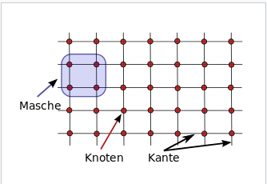

- [[📝 Grundgedanken]]
	- Netzwerk
		- #frage Woraus besteht ein Netzwerk?
		  id:: 613e10b1-60ed-4bbc-9dd0-403bea2d39ae
			- #auskunft Ein Netzwerk besteht aus einer Menge von als Graph modellierbarer Knoten, die mittels Kanten verbunden sind, und durch verschiedene Verbindungen Maschen bilden.
			  id:: 613e1103-594c-471a-a2e6-d0d6569fb565
				- Als Netze oder Netzwerke werden Systeme bezeichnet, deren zugrundeliegende Struktur sich mathematisch als Graph modellieren lässt und die über Mechanismen zu ihrer Organisation verfügen. Der Graph besteht aus einer Menge von Elementen (Knoten), die mittels Verbindungen (Kanten) miteinander verbunden sind. Ein geschlossener Zug aus Kanten und Knoten heißt Masche.
				  [[@Netzwerk]]
			- #frage Was ist eine Masche in einem Netzwerk?
				- #auskunft Eine Masche ist eine geschlossen Struktur in einem Netzwerk, der dadurch entsteht, das einzelne Knoten mit mehreren anderen Knoten verbunden sind.
				  collapsed:: true
				  id:: 613e1167-2087-4874-91bd-9b5db30d3ed7
					- 
					  [[@Netzwerk]]
	- Hierarchie / Baum
		- #frage Wie ist ein hierarchischer Graph aufgebaut?
			- #auskunft Ein Baum besteht aus Knoten und Kanten, die keine geschlossenen Pfade enthalten. Ein Baum lässt sich als hierarchische Struktur aufzeichnen.
			  collapsed:: true
				- Ein Baum ist in der Graphentheorie ein spezieller Typ von Graph, der zusammenhängend ist und keine geschlossenen Pfade enthält, d. h. damit lässt sich eine Monohierarchie modellieren.
				  [[@Baum (Graphentheorie)]]
	- Tags & backlinks
		- #frage Wie werden Inhalte durch Tags verbunden?
			- #auskunft Tags werden verwendet um verschiedene Inhalte zu gruppieren. Alle Inhalte mit einem spezifischen Tag werden zu einer Gruppe.
		- #frage Wie werden Inhalte durch backlinks verbunden?
			- #auskunft Backlinks stellen eine Kante zwischen zwei spezifischen Inhalten dar.
			  collapsed:: true
			  id:: 613e1e34-4df6-4a38-b339-4063c33e4889
				- ((613e1103-594c-471a-a2e6-d0d6569fb565))
			- #auskunft Da eine Seite mehrere Male durch backlinks referenziert sein kann, können auch mit backlinks mehrere Seiten in einen Zusammenhang gebracht werden.
			- #vermutung Backlinks stellen nicht nur eine Verbindung von Inhalten dar, sondern verändern auch die Bedeutung der betroffenen Inhalte, da diese auch in Zukunft immer wieder mit dem referenzierten Inhalt assoziiert werden.
			  id:: 613e1e8e-a003-409c-985a-de88af49ba2a
- 📗 Denkzettel
	- [[📗 Der Unterschied zwischen einer Gruppierung und einer Verknüpfung]]
	- [[📗 Maschen als Grundlage eines Netzwerkes]]
	- [[📗 Verknüpfung von Inhalten durch Backlinks]]
	- [[📗 Grupppierung von Inhalten durch Tags]]
	- [[📗 Der Unterschied zwischen einem Baum und einem Netzwerk]]
	- [[📗 Schattendasein des Zettelkastens]]
	- [[📗 Eindeutige Identifikation von Inhalten]]
	-