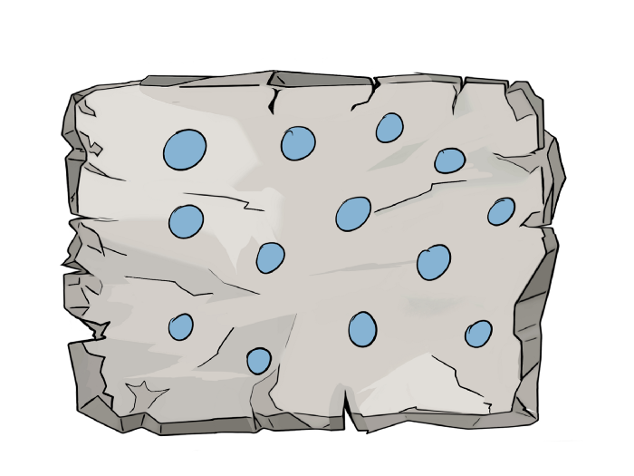
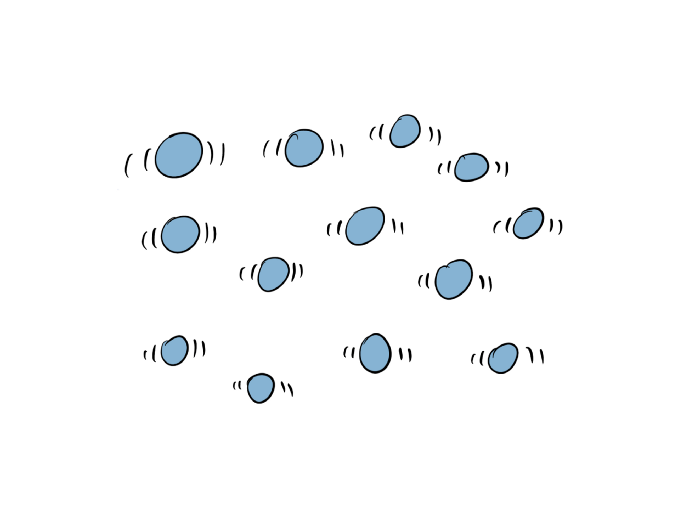
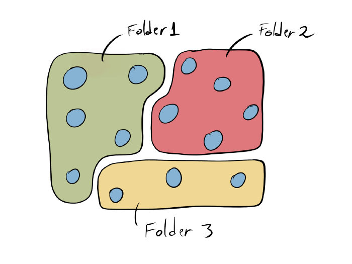
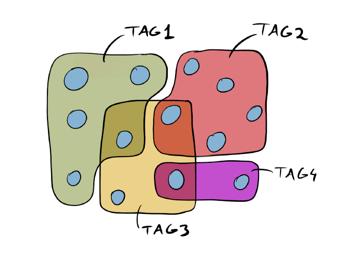
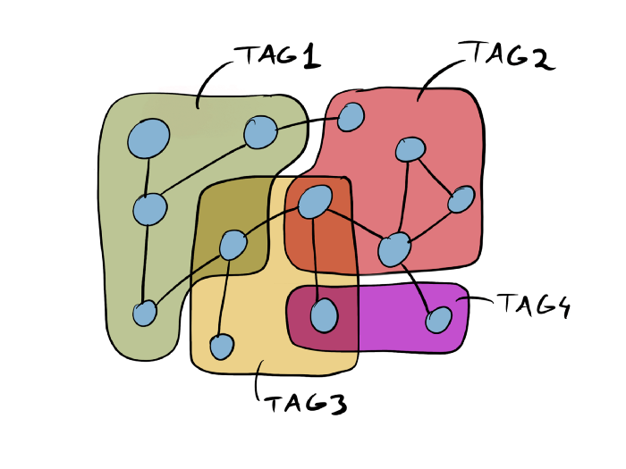

- [[💭 Schnipsel]]
  collapsed:: true
	- Zettelkasten - Wie ein Deutscher Gelehrter so unglaublich produktiv war
		- _As you’ll see, the Zettelkasten method is as much about a piece of furniture as writing is about a little stick. _
		- Mind Maps, Gliederungen und Concept Maps gehen in die Richtung von vernetzten Notizen. Verbindungen zwischen Notizen werden dargestellt. Diese Methoden sind aber für ein paar Notizen gemacht, nicht für eine Sammlung sämtlicher Notizen - da kommt der Zettelkasten ins Spiel.
		  id:: 6156fc0a-f208-4ded-8c81-2a2e30798735
		- Illustrationen und Gedanken zu verschiedenen Notizsystemen: (CC BY-SA 4.0)
			- Notizen in einem Notizbuch:
			  {:height 174, :width 221}
				- Die Notizen sind wie betoniert. Sie können nicht verbunden oder sortiert werden.
				  id:: 6156fd1c-5597-4e28-ac42-e381577fc4b4
			- Notizzettel ohne Struktur
			  {:height 135, :width 224}
				- Die Notizen sind zwar frei beweglich, aber es gibt keine Verbindungen.
				  id:: 6156fcfd-4fd6-473a-8eed-241405d41445
			- Notizzettel in Ordnern
			  {:height 115, :width 217}
				- Die Zettel können nur in einem Ordner sein
				  id:: 6156fd54-86d3-4153-b565-71c6a87f3cd7
				- Beziehungen zwischen Inhalten aus verschiedenen Ordnern sind nicht möglich
				  id:: 6156fd80-3716-43e6-9204-860aee867f29
			- Notizzettel mit Tags
			  {:height 210, :width 199}
				- Notizen können mit mehreren Tags ausgestattet werden, was eine flexible Struktur ermöglicht
				  id:: 6156fdb8-a8b0-4258-bbae-1a8477dfd799
				- Die Notizen eines spezifischen Tags sind immer noch eine Zusammenhangslose Sammlung ohne konkrete Verbindungen
				  id:: 6156fdec-642d-4447-8605-3895985f3816
			- Notizzettel mit Tags und Verknüpfungen
			  {:height 175, :width 198}
				- Die Notizen sind nicht nur gruppiert, sondern auch explizit miteinander verbunden.
				  id:: 6156fe1b-1f8d-4bbd-8614-9b03f2436393
				- Struktur wird auch vom Internet und von Neuronen verwendet.
				  id:: 6156fefc-9f08-4933-9749-fa12cbcce9e6
		- _Instead of the system deteriorating the more you add to it, it becomes better. Again, it’s like your brain. No one would suggest that having more neurons would make you dumber. It’s the same with the Zettelkasten. More notes means more ideas and more connections, and the more ideas and connections you have, the “smarter” your Zettelkasten becomes and the more insightful your writing will be._
		  id:: 6156ff24-47a3-4a24-8937-f7eedb514feb
		- Es besteht ein Zusammenhang zwischen der Relevanz und dem Überraschungseffekt einer Information. (=> Shannon information)
		  id:: 615700e9-655f-489a-8466-24a33fc8e710
		- Das aktive Verknüpfen von Ideen verbessert das Verständnis der Idee.
		  id:: 6157013f-1ccb-4366-8973-d35bd9ee9fa7
		- Da der Zettelkasten darauf ausgelegt ist, Informationen auf lange Zeit zu speichern, und da mehr Notizen den Inhalt eines Zettelkastens wertvoller machen, ist es nie eine Verschwendung, eine Notiz hinzuzufügen.
		  id:: 61570175-21ff-40d9-acf4-9374d01388ec
		- Drei Gründe für bessere Gedanken mit einem Zettelkasten
			- Man muss Schreiben. Durch das Schreiben und Umformulieren werden Ideen besser verstanden.
			  id:: 61570228-6b74-4750-b426-806ddae50c03
			- ((6157013f-1ccb-4366-8973-d35bd9ee9fa7))
			- Wenn einzelne Notizen verknüpft werden, entstehen ganze Gedankenstränge, die als Stränge gespeichert werden.
			  id:: 61570288-24cf-4e1e-b850-90ecc2044199
	- Zettelkasten Method Smart Notes for Knowledge Management
		- Der Sinn hinter dem Schreiben von Notizen ist nicht das Festhalten von Informationen und auch nicht die Tatsache, dass wir uns Dinge die wir aufschreiben besser merken können. Gute Notizen helfen beim Denken.
		  id:: 615725c7-b7f0-493e-ba97-63f1e52c5aa6
- [[📝 Grundgedanken]]
	- Erklärungsversuch des Zettelkastens
		- #frage Was unterscheidet Konzepte wie Mind Maps, Gliederungen und Concept Maps von einem System wie dem Zettelkasten?
			- #auskunft Konzepte wie Mind Maps gehen zwar in die Richtung von vernetzten Notizen, indem sie die Verbindungen zwischen einzelnen Punkten ins Zentrum stellen. Sie tun dies aber nur für eine kleine Anzahl von Punkten und nicht für eine Sammlung von Notizen, die sich über Jahre ansammelt und die auch noch Jahre weiterbestehen soll.
			  collapsed:: true
			  id:: 61570b0e-9b8e-4428-abd7-73d31d760427
				- ((6156fc0a-f208-4ded-8c81-2a2e30798735)) 
				  [[@Zettelkasten — How One German Scholar Was So Freakishly Productive]]
		- #frage Was passiert mit dem Zettelkasten wenn immer mehr Notizen hinzugefügt werden?
			- #auskunft Der Zettelkasten kann sich durch seine vernetzte Struktur sehr gut an eine immer grösser werdende Masse von Notizen anpassen. Mehr Notizen führen zu mehr Verbindungen, was zu mehr Ideen führt.
			  collapsed:: true
			  id:: 61570bf0-a67d-4664-97c3-1fc66bceaf83
				- ((6156ff24-47a3-4a24-8937-f7eedb514feb)) 
				  [[@Zettelkasten — How One German Scholar Was So Freakishly Productive]]
		- #frage Was bringen überraschende Verbindungen?
			- #auskunft Es besteht ein Zusammenhang zwischen der Relevanz und dem Überraschungseffekt einer Information. Wenn eine Information keine Überraschung birgt, dann enthält sie wohl auch wenig neue Gedanken.
			  collapsed:: true
			  id:: 61570d3c-8627-4a07-84f3-18b1ac721713
				- ((615700e9-655f-489a-8466-24a33fc8e710)) 
				  [[@Zettelkasten — How One German Scholar Was So Freakishly Productive]]
			- ((60fa78d9-3599-4c91-9ea9-28c249537ba0))
		- #frage Wann lohnt es sich, dem Zettelkasten eine Notiz hinzuzufügen?
			- #auskunft Da der Zettelkasten erstens gut mit vielen Notitzen umgehen kann und zweitens darauf ausgelegt ist, über Jahre hinweg gebraucht zu werden, macht es eigentlich immer wenn einem ein spannender Gedanke kommt Sinn, diesen auch festzuhalten.
			  collapsed:: true
				- ((61570175-21ff-40d9-acf4-9374d01388ec))
				  [[@Zettelkasten — How One German Scholar Was So Freakishly Productive]]
		- #frage Wie ermöglicht es der Zettelkasten, auf bessere Gedanken zu kommen?
			- #auskunft Da sämtliche Ideen aufgeschrieben und selbst ausformuliert werden müssen, werden die Ideen auch gleich besser verstanden.
			  collapsed:: true
				- ((61570228-6b74-4750-b426-806ddae50c03))
				  [[@Zettelkasten — How One German Scholar Was So Freakishly Productive]]
			- #auskunft Da jede Notiz mit anderen Notizen verknüpft wird, muss man sich auch gleich Gedanken über den Kontext der Idee und deren Zusammenhänge zu anderen Ideen machen. Auch das vertieft das Verständnis einer Idee.
			  collapsed:: true
				- ((6157013f-1ccb-4366-8973-d35bd9ee9fa7))
				  [[@Zettelkasten — How One German Scholar Was So Freakishly Productive]]
			- #auskunft Da Ideen verknüpft werden, können ganze Gedankenstränge gespeichert werden. So kann ein alter Gedankenstrang auch später wieder aufgenommen und weitergeführt werden.
			  collapsed:: true
			  id:: 61571001-bb7f-420a-b16b-4572aca712bf
				- ((61570288-24cf-4e1e-b850-90ecc2044199))
				  [[@Zettelkasten — How One German Scholar Was So Freakishly Productive]]
		- #frage Wie sind Notizen in einem linearen Notizbuch strukturiert?
			- #auskunft In einer klassischen linearen Struktur sind die Notizen wie betoniert. Sie sind fest an ihre Position gebunden, und es gibt keine Möglichkeit zur Verknüpfung von Notizen, die weiter voneinander entfernt sind.
			  collapsed:: true
				- ((6156fd1c-5597-4e28-ac42-e381577fc4b4))
				  [[@Zettelkasten — How One German Scholar Was So Freakishly Productive]]
			- {:height 174, :width 221}
			  CC BY-SA 4.0
		- #frage Wie verhält sich ein Haufen unstruktierter Notizzettel?
			- #auskunft Wenn die Notizen in atomisierter Form auf einzelnen Zetteln statt in einem Notizbuch stehen, sind sie frei sortierbar. Es gibt aber immer noch keine festen Verbindungen.
			  collapsed:: true
				- ((6156fcfd-4fd6-473a-8eed-241405d41445))
				  [[@Zettelkasten — How One German Scholar Was So Freakishly Productive]]
			- {:height 135, :width 224}
			  CC BY-SA 4.0
		- #frage Was für eine Struktur geben Ordner in einem Notizsystem?
			- #auskunft Ordner sind eine einfache Form um einige Notizen zu einem Thema zu gruppieren. Die Notizen können aber nur in einem Ordner zur gleichen Zeit sein und die genaue Beziehung zwischen den Notizen in einem Ordner ist immer noch nicht definiert. Weiter können die Notizen nicht über die Ordner hinweg verknüpft werden.
			  collapsed:: true
				- ((6156fd54-86d3-4153-b565-71c6a87f3cd7))
				  [[@Zettelkasten — How One German Scholar Was So Freakishly Productive]]
				- ((6156fd80-3716-43e6-9204-860aee867f29))
				  [[@Zettelkasten — How One German Scholar Was So Freakishly Productive]]
			- {:height 115, :width 217}
			  CC BY-SA 4.0
		- #frage Wie können Notizen durch Schlagwörter strukturiert werden?
			- #auskunft Im Gegensatz zu Ordnern bieten Schlagwörter die Möglichkeit, einzelne Inhalte mehreren Gruppen hinzuzufügen. Das Problem der fehlenden direkten Beziehung von Inhalten besteht aber immer noch. Darum braucht es um viele Notizen zu sortieren entweder sehr viele verschieden Schlagwörter, oder viele Notizen müssen einem Schlagwort zugeordnet sein. Dies führt früher oder später zu einer unüberblickbaren Unordnung.
			  collapsed:: true
				- ((6156fdb8-a8b0-4258-bbae-1a8477dfd799))
				  [[@Zettelkasten — How One German Scholar Was So Freakishly Productive]]
				- ((6156fdec-642d-4447-8605-3895985f3816))
				  [[@Zettelkasten — How One German Scholar Was So Freakishly Productive]]
			- {:height 205, :width 233}
			  id:: 6157225a-5605-4861-950d-1b318eb886bc
			  CC BY-SA 4.0
		- #frage Wie sieht eine Struktur die aus Schlagwörtern und Verlinkungen besteht aus?
			- #auskunft Die Schlagwörter können dazu verwendet werden, Inhalte in einen grösseren Kontext zu stellen. Gleichzeitig sind aber die Inhalte immer auch direkt untereinander verknüpft. So muss erstens nicht jede Notiz mit einem Schlagwort ausgestattet sein und zweitens stehen die verknüpften Notizen auch wirklich in einem direkten Zusammenhang.
			  collapsed:: true
			  id:: 6157230a-08ca-4836-985d-c3fbeed919fa
				- ((6156fe1b-1f8d-4bbd-8614-9b03f2436393))
				  [[@Zettelkasten — How One German Scholar Was So Freakishly Productive]]
				- ((6156fefc-9f08-4933-9749-fa12cbcce9e6))
				  [[@Zettelkasten — How One German Scholar Was So Freakishly Productive]]
			- {:height 175, :width 198}
			  id:: 61572385-1b80-4b08-bda5-109e3aaf94f4
			  CC BY-SA 4.0
	- Wieso Notizen?
		- #frage Was spricht dafür, gute Notizen zu machen?
			- #auskunft Gute Notizen sind nicht einfach dazu da um Informationen festzuhalten. Auch die Tatsache, dass sich die meisten Menschen aufgeschriebene Dinge besser merken können ist noch nicht der gute Grund für Notizen. Denn gute Notizen können beim Denken helfen, und zwar über lange Zeit.
			  collapsed:: true
				- ((615725c7-b7f0-493e-ba97-63f1e52c5aa6)) 
				  [[@Zettelkasten Method: How to Take Smart Notes (A Beginner's Guide)]]
			- #vermutung Gute Notizen sind lange haltbar.
			  id:: 61582b0f-9ef9-4167-89b3-31bd551c3a04
- 📗 Denkzettel
	- Vorteile von vernetzten Notizen
		- [[📗 Vernetzte Notizen für einen Blick von Aussen]]
		- [[📗 Einbettung von Notizen in ein Netzwerk]]
		- [[📗 Inneres Wachstum im Netzwerk von Notizen]]
	- Funktionsweise des Zettelkastens
	-