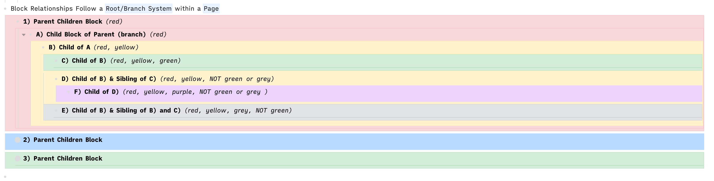

tags:: Struktur
typ:: [[📗 Zettel]]

- Die hierarchische Struktur in einem [[Gliederungseditor]] [definiert die Verbindung verschiedener Inhaltsblöcke](((6152b873-6039-4cd5-af17-e64fabfc113b))). So teilt jeder Block die Eigenschaften der Blöcke höherer Stufe, unter welchen er eingerückt ist. Er vererbt seine eigenen Eigenschaften an sämtliche Blöcke niederer Stufe, die sich in der Struktur unter ihm befinden. Zu anderen Blöcken derselben Stufe steht ein Block in keiner direkten Verbindung.
	- Im Englischen werden für diese Struktur die Begriffe "Parent", "Child" und "Sibling" verwendet. Teilweise wird auch im Deutschen Sprachgebrauch von Elternteil, Kind und Geschwister gesprochen.
- {:height 187, :width 704}
  https://pbs.twimg.com/media/EsXwsDlU0AAWHo0?format=jpg&name=4096x4096
-
- <=>
	- [[📗 Kanten in Graphbasierten Notizapps]]